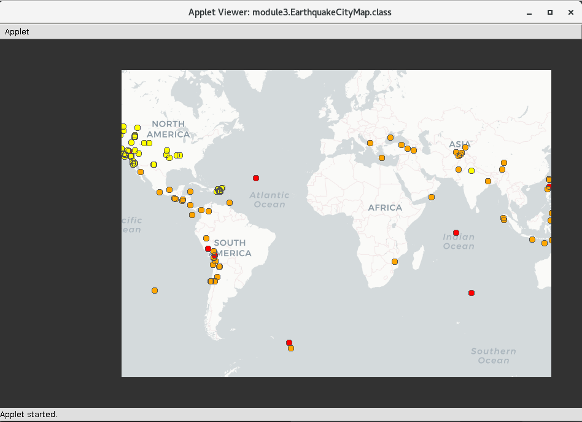

# Earthquake Visual

Earthquake Visual is an application with an interactive map displaying earthquake data. It uses:

  - PApplet as Java Application creator
  - Google Maps as a map to host earthquake sites

> 

### Todo
* Create customized markers
    * Based on magnitude <-- DONE
    * Based on location (land or sea)
* A legend to determine different markers
* A hover function over markers for more information
* A filter function

Note that this project is still in progress, will provide more updates later this summer
